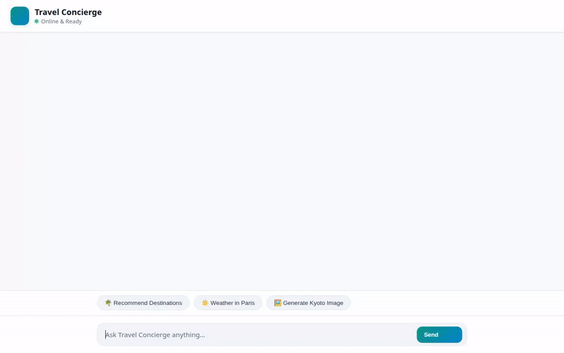

# ✈️ Travel Concierge Agent

An intelligent, multimodal AI Travel Concierge built with the **Google Agent Development Kit (ADK)** and **Gemini 2.5 Flash**. The agent helps users discover destinations, plan personalized itineraries, check live weather, convert currencies, look up nearby attractions, generate scenic AI preview images and videos, and remember user preferences across sessions.

## 🎥 Demo



📹 Full Demo Video: demo.mp4

---

## 🌟 Key Features & Implemented Capabilities

Every capability listed below is implemented in code (`app/agent.py`) and wired up to Google Cloud services:

### 🧠 Persistent Long-Term Memory
* **Vertex AI Memory Bank**: Uses `VertexAiMemoryBankService` and `PreloadMemoryTool` to remember user preferences, dietary restrictions, travel facts, and past interactions across conversations.
* **Memory Callback**: Automatically persists session turn state to the Memory Bank via `after_agent_callback`.

### 🗄️ Destination Catalog (Firestore)
* **Firestore Integration**: Powered by Google Cloud Firestore for managing destination records (`destinations` collection).
* **Tools**:
  * `list_destinations()`: Lists all destinations available in the catalog.
  * `get_destination_details(destination_id)`: Fetches full details for a specific destination by key.
  * `add_destination(...)`: Adds or updates destination documents in Firestore.

### 🎨 Multimodal Media Generation & Storage
* **AI Image Generation**: Generates scenic destination previews using `gemini-3.1-flash-lite-image` on Vertex AI (`generate_destination_image`).
* **AI Video Preview**: Generates cinematic destination videos using `gemini-omni-flash-preview` in the `global` Vertex AI region (`generate_destination_video`).
* **Cloud Storage Artifacts**: Generated media is saved as ADK Playground artifacts (`tool_context.save_artifact`) and uploaded to a public **Google Cloud Storage** bucket (`travel-concierge-images-*`) for public HTTPS link rendering.

### 🎨 A2UI (Agent-to-User Interface) Support
* **A2UI Protocol (0.8)**: Generates structured, display-ready UI cards (Cards, Columns, Rows, Text, Images) using `A2uiSchemaManager` and `BasicCatalog`.
* **A2UI Callback**: Transforms model output into rich UI surfaces via `a2ui_callback` (`after_model_callback`).

### 🌐 Real-Time Travel Tools & APIs
* **Live Weather**: Fetches real-time weather and temperature worldwide via Open-Meteo API (`get_live_weather`).
* **Currency Conversion**: Converts money amounts between international currencies with live exchange rates (`convert_currency`).
* **Google Maps Geocoding**: Converts addresses and landmark names into latitude/longitude coordinates via Google Maps Geocoding API (`geocode_address`).
* **Google Places Search**: Discovers nearby attractions, restaurants, and hotels via Google Places API New (`search_nearby_places`).
* **Timezone Lookup**: Returns current local time for destination cities (`get_current_time`).
* **Code Executor**: Includes `AgentEngineSandboxCodeExecutor` for executing Python code blocks safely during agent reasoning.

---

## 🛠️ Architecture & Tech Stack

* **Framework**: Google Agent Development Kit (ADK 1.1.0)
* **Model**: Gemini 2.5 Flash (`gemini-2.5-flash`) & Gemini Omni Flash Preview (`gemini-omni-flash-preview`)
* **Database**: Google Cloud Firestore
* **Storage**: Google Cloud Storage
* **Memory**: Vertex AI Memory Bank
* **Frontend**: Custom FastAPI proxy (`app/fast_api_app.py`) with a modern responsive HTML/CSS/JS interface (`frontend/static/index.html`)

---

## 🚀 Local Setup & Running Instructions

### Prerequisites
- Python 3.10+ and `uv` or `pip`
- `gcloud` CLI logged into Google Cloud
- A Google Cloud Project with Firestore, Vertex AI, and Cloud Storage enabled

### 1. Environment Configuration
Copy `.env.example` to `.env` and set your configuration variables:

```bash
cp .env.example .env
```

Ensure your `.env` contains your GCP project settings:
```ini
GOOGLE_CLOUD_PROJECT=your-gcp-project-id
GOOGLE_CLOUD_LOCATION=us-east1
GOOGLE_GENAI_USE_VERTEXAI=True
```

### 2. Install Dependencies & Seed Database
Install the Python dependencies and seed the Firestore database with sample destinations:

```bash
pip install -r requirements.txt
python seed_firestore.py
```

### 3. Run the Local App Server
Start the local FastAPI server serving the agent and custom chat UI:

```bash
export AGENT_DIRECTORY="app"
python main.py
```

Open your web browser and navigate to port `8080` on `localhost` to interact with the Travel Concierge.

---

## 📁 Repository Structure

```
travel-concierge-agent/
├── app/
│   ├── agent.py               # Core ADK agent definition, Memory Bank, Firestore & AI tools
│   ├── a2ui_utils.py          # A2UI callback and schema formatting utilities
│   └── fast_api_app.py        # FastAPI proxy bridging frontend to the agent runtime
├── frontend/
│   └── static/
│       └── index.html         # Custom branded web chat frontend
├── seed_firestore.py          # Script to populate Firestore destination database
├── agents-cli-manifest.yaml   # ADK Agent Runtime deployment manifest
├── demo.gif                   # Looping preview recording of the agent in action
└── requirements.txt           # Python dependencies
```
